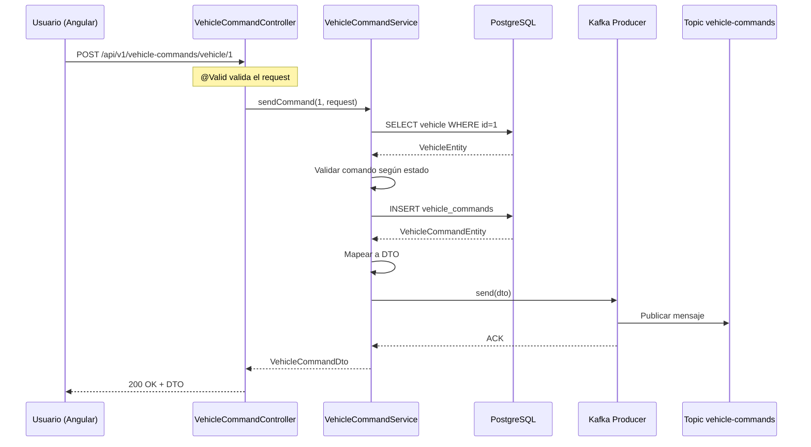
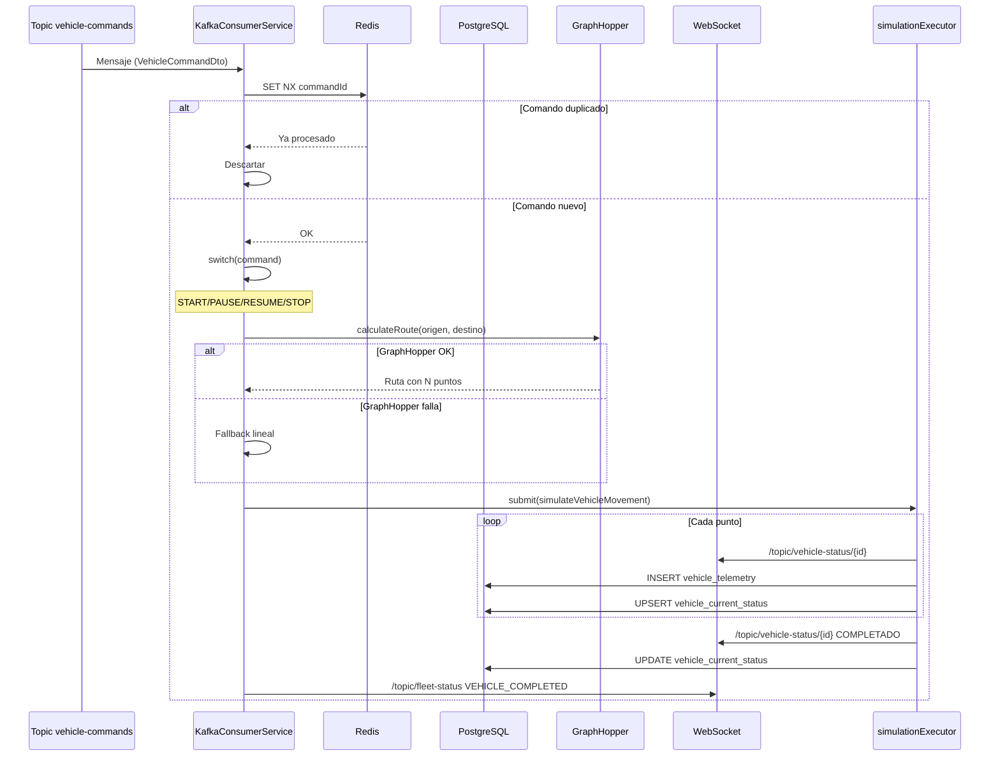
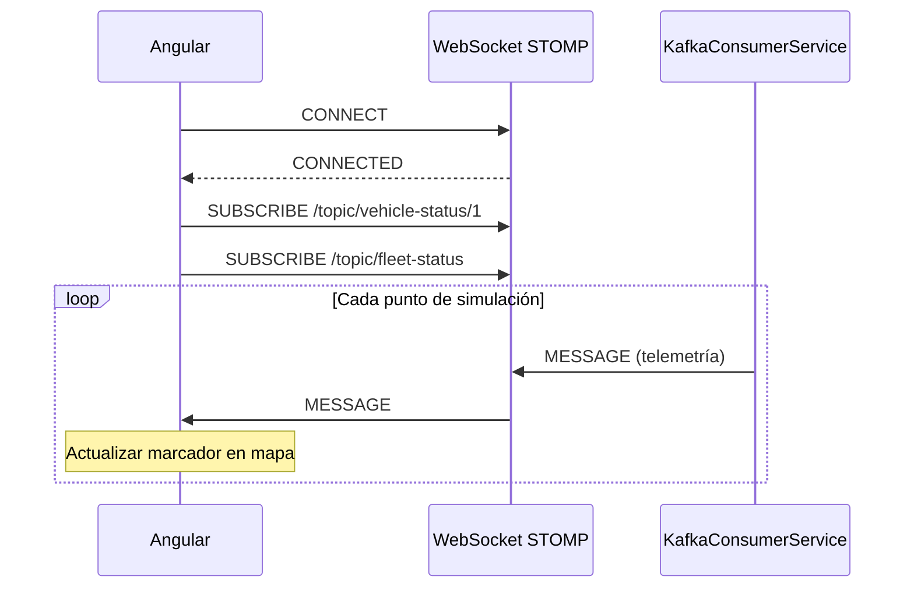

# Arquitectura del Sistema E-Cargo Hub

Este documento describe la arquitectura técnica del sistema **E-Cargo Hub**, incluyendo los componentes principales, sus interacciones, los flujos de datos y las decisiones de diseño adoptadas.

---

## 1. Visión general

E-Cargo Hub es un sistema de información web basado en una **arquitectura orientada a eventos (Event-Driven Architecture)** con las siguientes características:

- **Backend** desacoplado mediante Apache Kafka como bus de mensajería.
- **Comunicación en tiempo real** con el frontend vía WebSocket/STOMP.
- **Persistencia** en PostgreSQL con JPA/Hibernate.
- **Idempotencia** garantizada por Redis.
- **Frontend SPA** desarrollado en Angular.
- **Despliegue** containerizado con Docker Compose.

### Diagrama de componentes

```
┌─────────────────────────────────────────────────────────────────────┐
│                         FRONTEND (Angular 18)                       │
│                                                                     │
│   ┌─────────────┐   ┌──────────────┐   ┌─────────────────────┐    │
│   │  Dashboard  │   │  Mapa Leaflet│   │  Panel de control   │    │
│   └─────────────┘   └──────────────┘   └─────────────────────┘    │
└────────────┬──────────────────────────────────┬─────────────────────┘
             │                                  │
             │ HTTP/REST                        │ WebSocket/STOMP
             │ (JSON)                           │ (STOMP frames)
             ▼                                  ▼
┌─────────────────────────────────────────────────────────────────────┐
│                    BACKEND (Spring Boot 4)                          │
│                                                                     │
│   ┌─────────────────┐   ┌──────────────────┐   ┌────────────────┐  │
│   │  Controllers    │   │   Services       │   │  WebSocket     │  │
│   │  (REST API)     │──►│   (Business)     │──►│  (STOMP Broker)│  │
│   └─────────────────┘   └──────────────────┘   └────────────────┘  │
│           │                       │                                │
│           │                       │                                │
│           ▼                       ▼                                │
│   ┌─────────────────┐   ┌──────────────────┐   ┌────────────────┐  │
│   │  Repositories   │   │  Kafka Producer  │   │  Kafka Consumer│  │
│   │  (Spring Data)  │   │                  │   │  (@KafkaListener)│ │
│   └─────────────────┘   └──────────────────┘   └────────────────┘  │
└────────────┬────────────────────────┬───────────────────┬──────────┘
             │                        │                   │
             ▼                        ▼                   ▼
┌─────────────────────┐   ┌───────────────────┐   ┌─────────────────┐
│    PostgreSQL       │   │   Apache Kafka    │   │      Redis      │
│  (Persistencia)     │   │   (Event Bus)     │   │  (Idempotencia) │
└─────────────────────┘   └────────┬──────────┘   └─────────────────┘
                                   │
                                   ▼
                          ┌───────────────────┐
                          │    GraphHopper    │
                          │  (API externa)    │
                          └───────────────────┘
```

---

## 2. Componentes

### 2.1. Backend (Spring Boot 4)

El backend sigue el patrón **MVC en capas**:

| Capa | Paquete | Responsabilidad |
|---|---|---|
| **Controller** | `com.ecargohub.backend.controller` | Exponer endpoints REST, validar entradas, devolver DTOs |
| **Service** | `com.ecargohub.backend.service` | Lógica de negocio, orquestación, transacciones |
| **Repository** | `com.ecargohub.backend.repository` | Acceso a datos (Spring Data JPA) |
| **Entity** | `com.ecargohub.backend.entity` | Modelo de datos (JPA entities) |
| **DTO** | `com.ecargohub.backend.dto` | Objetos de transferencia entre capas |
| **Mapper** | `com.ecargohub.backend.mapper` | Conversión Entity ↔ DTO (MapStruct) |
| **Kafka** | `com.ecargohub.backend.kafka` | Producer y Consumer de Kafka |
| **Config** | `com.ecargohub.backend.config` | Configuración (Kafka, CORS, OpenAPI, WebSocket) |
| **Exception** | `com.ecargohub.backend.exception` | Excepciones personalizadas y manejador global |

### 2.2. Frontend (Angular 18)

El frontend sigue el patrón **Component-Based Architecture**:

| Carpeta | Responsabilidad |
|---|---|
| `core/models` | Interfaces TypeScript (DTOs espejo del backend) |
| `core/services` | Servicios inyectables (HTTP, WebSocket) |
| `features/dashboard` | Componente principal del panel |
| `features/fleet-map` | Componente del mapa Leaflet |
| `features/vehicle-list` | Tabla paginada de vehículos |
| `shared/components` | Componentes reutilizables (badges, botones) |

### 2.3. Apache Kafka

**Uso:** bus de mensajería para desacoplar el envío de comandos de su procesamiento.

**Topic principal:** `vehicle-commands`

**Particiones:** 1 (suficiente para el alcance del TFG)

**Grupo de consumidores:** `e-cargo-hub-consumers`

**Formato del mensaje:** JSON con `VehicleCommandDto`.

### 2.4. Redis

**Uso:** idempotencia de comandos.

**Estrategia:** `SET NX` con TTL de 24h por cada `commandId` procesado.

**Clave:** `e-cargo-hub:processed-command:{commandId}`

### 2.5. PostgreSQL

**Uso:** persistencia de vehículos, comandos, estado actual y telemetría.

**Esquema:** ver `docs/DATA_MODEL.md`.

### 2.6. GraphHopper

**Uso:** cálculo de rutas reales por carretera.

**Estrategia:** caché LRU en memoria (100 rutas) con fallback lineal si falla.

---

## 3. Flujos principales

### 3.1. Flujo 1 — Envío de comando (REST → Kafka)



### 3.2. Flujo 2 — Procesamiento de comando (Kafka → Simulación)



### 3.3. Flujo 3 — Telemetría en tiempo real (WebSocket)



---

## 4. Decisiones de diseño

### 4.1. ¿Por qué Apache Kafka?

- **Desacoplamiento**: el controller no espera a que la simulación termine.
- **Resiliencia**: si el consumer cae, los mensajes se retienen en el topic.
- **Escalabilidad horizontal**: se pueden añadir más consumers en paralelo.
- **Trazabilidad**: todos los comandos quedan en el topic.

### 4.2. ¿Por qué Redis para idempotencia?

- **Rendimiento**: `SET NX` es O(1).
- **TTL automático**: no hay que limpiar manualmente.
- **Atómico**: evita race conditions en consumidores concurrentes.
- **Alternativa descartada**: tabla en PostgreSQL (más lento, requiere limpieza).

### 4.3. ¿Por qué WebSocket/STOMP y no SSE?

- **Bidireccional**: el cliente puede enviar comandos por el mismo canal (en el futuro).
- **Pub/Sub nativo**: STOMP permite suscripción a múltiples canales.
- **Amplio soporte**: Angular tiene `@stomp/stompjs` bien mantenido.

### 4.4. ¿Por qué Jackson 3 y no Jackson 2?

- **Alineado con Spring Boot 4**.
- **Rendimiento mejorado** en deserialización.
- **Soporte nativo** de `java.time` (no requiere `JavaTimeModule`).
- **Migración obligatoria** en Spring Boot 4.

### 4.5. ¿Por qué GraphHopper con caché y fallback?

- **Rutas reales**: mejora la experiencia del usuario.
- **Caché LRU**: evita agotar el rate limit del plan gratuito.
- **Fallback lineal**: garantiza que la simulación nunca se rompa.

### 4.6. ¿Por qué MapStruct?

- **Generación en tiempo de compilación** (sin reflexión en runtime).
- **Type-safe**: errores de mapeo en compilación, no en ejecución.
- **Sin boilerplate**: menos código que un mapper manual.

---

## 5. Patrones de diseño aplicados

| Patrón | Dónde | Propósito |
|---|---|---|
| **MVC** | Controller-Service-Repository | Separación de responsabilidades |
| **DTO** | `com.ecargohub.backend.dto` | Desacoplar entidades de la API |
| **Mapper** | MapStruct | Conversión Entity ↔ DTO |
| **Repository** | Spring Data JPA | Abstracción del acceso a datos |
| **Event-Driven** | Kafka | Desacoplamiento de comandos |
| **Publish/Subscribe** | WebSocket STOMP | Notificación en tiempo real |
| **Singleton** | Beans de Spring | Una sola instancia por bean |
| **Strategy** | `computeSpeed(index, total)` | Algoritmo de velocidad variable |
| **LRU Cache** | `GraphHopperService` | Caché con evicción del más antiguo |
| **Circuit Breaker (implícito)** | Fallback de GraphHopper | Degradación controlada |

---

## 6. Limitaciones conocidas

- **Rate limit de GraphHopper** (plan gratuito): 500 créditos/día + límite por minuto. Mitigado con caché.
- **Persistencia de telemetría sin límite**: la tabla `vehicle_telemetry` crece indefinidamente. Pendiente: job de limpieza por antigüedad.
- **Un solo broker de Kafka**: sin replicación. Aceptable para desarrollo/TFG.
- **Autenticación básica actual**: pendiente migrar a JWT + roles.
- **Sin paginación**: pendiente en endpoints de listado.

---

## 7. Roadmap futuro

### Corto plazo (TFG)

- Autenticación JWT con roles (ADMIN, OPERADOR, VIEWER).
- Login con OAuth2 (Google).
- CRUD completo de usuarios.
- Paginación en endpoints de listado.
- Frontend Angular completo.
- Docker Compose con todos los servicios.
- Migraciones Flyway.
- Tests unitarios e integración.

### Medio plazo

- Persistencia de rutas calculadas (reutilización).
- Multi-tenant (varios clientes/empresas).
- Panel de administración.
- WebSocket con autenticación (STOMP headers con JWT).

### Largo plazo

- Soporte para más tipos de vehículos (bicicletas, drones).
- Integración con APIs de tráfico en tiempo real.
- Machine Learning para predicción de tiempos de entrega.
- Despliegue en Kubernetes.

---

## 8. Referencias

- [Documentación de Spring Boot](https://spring.io/projects/spring-boot)
- [Documentación de Apache Kafka](https://kafka.apache.org/documentation/)
- [Documentación de PostgreSQL](https://www.postgresql.org/docs/)
- [Documentación de Redis](https://redis.io/docs/)
- [Documentación de GraphHopper](https://docs.graphhopper.com/)
- [STOMP Protocol Specification](https://stomp.github.io/)